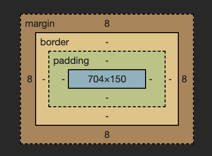

# 1. INTRODUCTION

# 1.3 Software Requirements

1. 구글 크롬 다운로드

2. vscode 다운로드

3. github desktop 다운로드

# 1.6 What is HTML

HTML is for Content.

# 1.7 What is CSS

CSS is for Design.

# 1.8 What is JavaScript

JavaScript is for Interactivity.

# 1.9 Recap

Markup Language

- HTML is for Content.

Style Language

- CSS is for Design.

Programming Language

- JavaScript is for Interactivity.

# 2.1 Setup and Errors

extensions

- Community Material Theme
- Material Icon Theme

# 2.7 More Tagse

- html tag search
  https://developer.mozilla.org/ko/docs/Web/HTML/Element
- 동시 변경 -> 영역 선택 -> ctrl(command) + d

# 2.10 Semantic HTML

- div -> division -> 그냥 박스
- 문서를 보기만해도 그 의미를 짐작할 수 있는 걸 sementic이라고 함
- header, main, footer

# 2.11 Recap

- 속성을 큰따움표로 사용하는것을 권장
- 태그는 검색해서 찾아서 붙여 넣기
- 자주 사용하는 것만 외우기, 모두 외울려고 하지말기.

# 3.0 How to Add CSS to HTML

- <style> 태그 사용하기
- <link> 태그를 사용해서 "style.css" 파일 임포트 하기
    <link href="styles.css" rel="stylesheet">
  ** href -> hypertext reference
  ** rel -> relationship

# 3.2 What Does Cascading Mean

- CSS 는 위에서 아래로 읽기 때문에 가장 하단에 있는 CSS 스타일이 최종적으로 적용됨

# 3.3 Blocks and Inlines

- Blocks - 한줄을 다 차지 : div, p, address 등등
- Inlines - 옆에 다른 요소가 올수 있음 : span, a, img 등등

# 3.4 Margin Part One



# 3.5 Margin Part Two

- margin: top right bottom left
  top+bottom right+left
- collapsing margins : Blocks에만 있는 특이한 현상으로 위아래 마진이 중복되는 경우 더 큰값을 가진 쪽으로 병합 되는 현상

# 3.8 Classes

- id는 유니크해야함. 따라서 여러 요소에 동시에 스타일을 적용하고 싶은 경우 클래스를 통해 할당 가능
- id에 css를 적용하는 경우 "#"을 접두사로 사용 클래스를 사용하는 경우 "."을 접두사로 사용

# 3.10 Flexbox Part One

- flexbox를 사용하려면 자식요소에 사용하지 말고 부모 요소에 사용할 것
- justify-content : main-axis / horizantal
- alingn-item : cross-axis / vertical
- vh - viewport height : 스크린 크기를 나타냄 100을 주면 화면의 100%를 의미

# 3.11 Flexbox Part Two

- flex-direction : 컨턴츠를 수평으로 나타낼지, 수직으로 표현할지 결정 - 기본 수평
  - reverse 옵션으로 역순 정렬도 가능

# 3.12 Fixed

- position: fixed; - 화면에 컨텐츠가 고정 됨
- position은 일반적으로 레이아웃 보다는 위치를 아주 조금 움직이고 싶을때 사용
- position fixed를 이용하면 스크롤해도 항상 제자리에 머무른다.
- 처음 만들어진 자리에 고정 되어있다. 하지만 top, left, right, bottom 중 하나만 수정해도 서로 다른 레이어에 위치하게되어 원래 위치가 무시된다.
- positon fixed를 이용하면 가장 위에 위치하게 된다. (맨 앞)

# 3.13 Relative Absolute

- positon: static; (default)
- position: fixed; -> element가 처음 생성된 자리에 고정.
- position: relative; -> element가 '처음 생성된 위치'를 기준점으로, top bottom left right으로 위치를 조금씩 수정할 수 있음

```
position: relative;
top: -10px;
```

- position: absolute; -> 가장 가까운 relative 부모를 기준으로 이동 position:relative; 를 해주면 부모가 됨. 없으면 body가 부모.

# 3.14 Pseudo Selectors part One

- # : id
- . : class
  div:first-child {
  background-color: teal;
  }
  div:last-child {
  background-color: red;
  }
  span:nth-child(5n) {
  background-color: teal;
  } -> even, odd 등

# 3.15 Combinators

- div의 바로 밑 자식에서 span을 찾아서 그것만 효과를 주는 방법

```
// 1
div span {
text-decoration : underline;
}
이렇게하면 div밑에 있는 모든 span이 효과를 가진다
직접적인 부모가 아니어도 밑에있는 것들을 모두 css가 찾는다.

// 2
div > span {
text-decoration : underline;
}
이렇게하면 바로 밑!!! 을 찾게 되므로 바로 밑의 자식만 건들일수있게된다.
```

- 형제에게 효과를 주는방법

```
p + span {
color: black;
}
+ 를 사용하면 형제에게 영향을 끼칠 수 있다. cool
```

# 3.16 Pseudo Selectors part Two

- \*= is 'contains'
- ~= is 'exactly'

# 3.17 States

1. active : 대상을 클릭하고 있는 상태
2. hover : 마우스가 대상 위에 있을때의 상태
3. focus : active와 비슷하다고 생각될 수 있는데, 키보드로 선택되었을때를 말한다 !
4. visited : 링크에만 적요이된다 그 링크에 방문했다면 그 안에 스타일이 적용이된다
5. focus-within : focuse된 자식을 가진 부모 엘리먼트의 상태를 말한다
   예시에서 form은 그 자식들인 input이 focus가 되면 form의 모습을 바꾼다는 의미

- state들을 다른 엘리먼트와 연계해서 사용 가능

1. 부모의 state에 따라 조정 - form이 hover일경우 input의 백그라운드 컬러가 바뀜, 부모의 state에 따라 자식의 state를 조정 가능

form:hover input {
background-color: slateblue;
}

2. 부모와 자식의 state에 따라 조정
   form:hover input:focus {
   background-color: teal;
   }

# 3.18 Recap

- 의사코드 정리

1. :: placeholder
   : placeholder의 특성만 바꾸고 싶을 때 사용

2. :: selection
   : 클릭해서 해당 영역을 긁어서 선택 할 떄 발생

3. :: first-letter
   : 첫 글자에만 적용

4. ::first-line
   : 첫 줄에만 작용

- state 정리

1. active
   : 클릭할 때 작동 (예: 버튼 클릭 시 색깔 변함)

2. hover
   : 마우스 커서를 올려놓으면 작동 (예: 글자 위에 마우스 커서 올려두면 색상 변함)

3. focus
   : element가 focused된 상태. 키보드 탭 버튼으로 이동하면서 생기는 그 모양

4. visited
   : 방문한 사이트 표시 (예: 애플 링크 눌러서 방문했는데, 다시 보니 해당 링크 색상이 빨강색으로 바뀌어 있음)

5. focus-within
   : focus되는 children이 있으면 작동. mozilla에서 가져온 예시
   div: focus-within {background-color: cyan}이면, div의 children이 focus 될 때 {}가 작동

6. form: hover input: focus{} 의 경우엔 두 조건 모두 만족해야 {} 안이 실행

# 3.19 Colors and Variables

- 색상 체계 (color system)

1. hex code
   : #2ecc71와 같은 색상 코드

2. rgb
   : 각각 red, green, blue를 의미
   가령, rgb(0,140,200)의 경우엔 red 값이 0, green 값이 140, blue 값이 200

3) rgba
   : 2와 동일하지만 a가 포함된 형태 'a(alpha)'는 투명도를 담당
   0(투명)~1(불투명) 사이의 값으로 조절할 수 있음

# variable

custom property -> 강의 variable의 정식 용어
: 작업량을 줄여줄 수 있는 기능

div {color: #2ecc71}
p {color: #2ecc71}
상태에서, 둘 모두의 색을 바꾸고 싶다면 우리는 div와 p의 색상 코드를 지우고, 또 다시 입력해야 함. 그러나 variable을 이용하면 더 간단해짐

- 네이밍 규칙 : -- 로시작 공백은 - 로 표현

:root {
--main-color: #fcce00;
}

p {
color: #ababab;
color: rgp(252, 206, 0);
background-color: var(--main-color);
}
a {
color: var(--main-color);
}

# 4.0 Transition

- transition : 어떤 상태에서 다른 상태로의 변화를 보내주는 애니매이션
  특징
- transtion은 state가 없는 요소에 붙어야함 -> state에 transition을 준다면 변화를 준것(예를들면 hover라면 마우스를 갖다 댄것)을 그만할경우(마우스를 뗄경우) 원래상태로 바로 돌아감
- transtion에 변화를 준것들은 state에 들어있는것들이 기준이 되어 바뀌는 것 -> 바뀌는 것들에 한정하여 transition 이 일어날 수 있음
